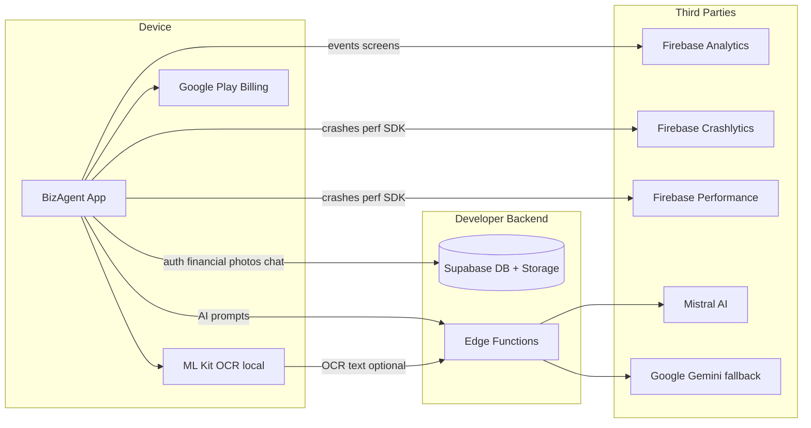

# BizAgent — Google Play Data Safety (copy-paste guide)

**Účel:** Presný návod na vyplnenie formulára **Data safety** v Google Play Console pre `sk.bizagent.app`.  
**Verzia kódu:** Supabase backend (auth, DB, storage) + Firebase Analytics / Crashlytics / Performance.  
**Posledná aktualizácia:** 2026-07-11

---

## 1. Wizard — fixed answers (skopíruj priamo)

| Otázka v Play Console | Odpoveď | Poznámka |
|---|---|---|
| Does your app collect or share any of the required user data types? | **Yes** | Všetky typy nižšie |
| Is all of the user data collected by your app encrypted in transit? | **Yes** | HTTPS/TLS — Supabase, Firebase, Edge Functions |
| Do you provide a way for users to request that their data is deleted? | **Yes** | In-app + web URL + email |
| Does your app contain ads? | **No** | `AD_ID` explicitne odstránené v manifeste |
| Target audience | **18 and over** | Podnikateľská / finančná aplikácia |
| Financial features in your app | **Yes** | Faktúry, výdavky, IAP predplatné |

### URL a kontakty (vlož do príslušných polí)

| Pole | Hodnota |
|---|---|
| Privacy policy URL | `https://bizagent.sk/privacy-policy.html` |
| Account deletion URL | `https://bizagent.sk/delete-account.html` |
| Kontakt pre vymazanie | `support@bizagent.sk` |
| In-app vymazanie | Nastavenia → sekcia „Odstránenie účtu" → **Zmazať účet a všetky dáta** |

**Dôkaz in-app vymazania:** [`lib/features/settings/screens/settings_screen.dart`](../lib/features/settings/screens/settings_screen.dart) L321–421 → [`lib/features/auth/providers/auth_repository.dart`](../lib/features/auth/providers/auth_repository.dart) L41–44 → [`supabase/functions/delete-account/index.ts`](../supabase/functions/delete-account/index.ts)

---

## 2. Tok dát (prehľad)



---

## 3. Third-party processors (Shared with)

Pri otázke **„Is this data shared with third parties?"** použi tabuľku nižšie.

| Tretia strana | Aké dáta | Kedy | Dôkaz v kóde |
|---|---|---|---|
| **Google (Firebase Analytics)** | App interactions, screen views, app instance ID | Automaticky + custom eventy | [`lib/core/services/analytics_service.dart`](../lib/core/services/analytics_service.dart), [`lib/core/router/app_router.dart`](../lib/core/router/app_router.dart) L56–58 |
| **Google (Firebase Crashlytics)** | Crash logs, stack traces | Automaticky (native SDK) | [`pubspec.yaml`](../pubspec.yaml) L23, [`android/app/build.gradle.kts`](../android/app/build.gradle.kts) L9 |
| **Google (Firebase Performance)** | Diagnostics, performance traces | Automaticky (native SDK) | [`pubspec.yaml`](../pubspec.yaml) L22, [`android/app/build.gradle.kts`](../android/app/build.gradle.kts) L8 |
| **Google (Sign-In OAuth)** | Email, meno (auth flow) | Len pri Google prihlásení | [`lib/core/supabase/google_auth_service.dart`](../lib/core/supabase/google_auth_service.dart) L29, L69–73 |
| **Google Play Billing** | Purchase history, purchase tokens | Pri IAP / obnovení | [`lib/features/billing/billing_service.dart`](../lib/features/billing/billing_service.dart) L4, L103–157 |
| **Mistral AI** | AI prompty (BizBot, OCR text, finančný kontext) | Pri AI volaniach | [`supabase/functions/generate-content/index.ts`](../supabase/functions/generate-content/index.ts) L34–72 |
| **Google Gemini** (fallback) | AI prompty | Ak je nastavený `GEMINI_API_KEY` | [`supabase/functions/generate-content/index.ts`](../supabase/functions/generate-content/index.ts) L74–98 |

**Nie je „Shared" (Collected only — vlastný backend):**

| Služba | Poznámka |
|---|---|
| **Supabase** (Postgres + Storage) | Vlastný projekt developera; Play Console to nepočíta ako zdieľanie s treťou stranou |
| **Google ML Kit OCR** | Spracovanie **lokálne na zariadení**; text neopúšťa zariadenie, pokiaľ používateľ nevolí AI refinement |

---

## 4. Data types matrix (hlavná tabuľka)

Pre každý typ v wizardi zaškrtni kategóriu a skopíruj odpovede z riadku.

| Play Console kategória | Collected? | Shared? | Ephemeral? | Required? | Purpose (zaškrtni v wizardi) | Dôkaz v kóde |
|---|---|---|---|---|---|---|
| **Personal info → Email address** | Yes | No* | No | Required (users can't use app without) | App functionality, Account management | [`lib/core/supabase/auth_backend.dart`](../lib/core/supabase/auth_backend.dart) L113–124 |
| **Personal info → Name** | Yes | No* | No | Optional (users can choose) | App functionality, Account management | [`lib/core/supabase/auth_backend.dart`](../lib/core/supabase/auth_backend.dart) L35–36 |
| **Personal info → User IDs** | Yes | Yes (Google Analytics) | No | Required | App functionality, Analytics | Supabase UUID: [`auth_backend.dart`](../lib/core/supabase/auth_backend.dart) L32–33; Analytics: [`app_router.dart`](../lib/core/router/app_router.dart) L57 |
| **Personal info → Address** | Yes | No | No | Optional | App functionality | [`lib/features/settings/models/user_settings_model.dart`](../lib/features/settings/models/user_settings_model.dart) L3, L22; [`lib/features/invoices/models/invoice_model.dart`](../lib/features/invoices/models/invoice_model.dart) L115 |
| **Financial info → User payment info** | Yes | No | No | Optional | App functionality | [`lib/features/settings/models/user_settings_model.dart`](../lib/features/settings/models/user_settings_model.dart) L7–8, L12–14 (IBAN, bankAccount, swift) |
| **Financial info → Other financial info** | Yes | No | No | Required | App functionality | Faktúry: [`invoice_model.dart`](../lib/features/invoices/models/invoice_model.dart) L112–147; Výdavky: [`expense_model.dart`](../lib/features/expenses/models/expense_model.dart) L3–19; Supabase tabuľky: [`delete-account/index.ts`](../supabase/functions/delete-account/index.ts) L15–17 |
| **Financial info → Purchase history** | Yes | Yes (Google Play) | No | Optional | App functionality | [`lib/features/billing/billing_service.dart`](../lib/features/billing/billing_service.dart) L5, L125–157 |
| **Photos and videos → Photos** | Yes | No | No | Optional (users can choose) | App functionality | OCR: [`lib/core/services/ocr_service.dart`](../lib/core/services/ocr_service.dart) L60–64; Upload: [`lib/core/supabase/supabase_storage_client.dart`](../lib/core/supabase/supabase_storage_client.dart) L74–93; [`create_expense_screen.dart`](../lib/features/expenses/screens/create_expense_screen.dart) L271–282 |
| **App activity → App interactions** | Yes | Yes (Google) | No | Required | Analytics | [`lib/core/services/analytics_service.dart`](../lib/core/services/analytics_service.dart); auto `screen_view`: [`app_router.dart`](../lib/core/router/app_router.dart) L57 |
| **App activity → Other user-generated content** | Yes | Yes (Mistral/Gemini) | No | Optional | App functionality | BizBot: [`lib/features/ai_tools/services/biz_bot_service.dart`](../lib/features/ai_tools/services/biz_bot_service.dart) L18–42; Edge fn: [`gemini_service.dart`](../lib/core/services/gemini_service.dart) L60–63; História: [`bizbot_history_provider.dart`](../lib/features/ai_tools/providers/bizbot_history_provider.dart) L13, L36–41 |
| **App info and performance → Crash logs** | Yes | Yes (Google) | No | Required | Analytics | [`pubspec.yaml`](../pubspec.yaml) L23; [`android/app/build.gradle.kts`](../android/app/build.gradle.kts) L9; init: [`lib/main.dart`](../lib/main.dart) L37–39 |
| **App info and performance → Diagnostics** | Yes | Yes (Google) | No | Required | Analytics | [`pubspec.yaml`](../pubspec.yaml) L22; [`android/app/build.gradle.kts`](../android/app/build.gradle.kts) L8 |

\* **Email / Name — Shared s Googleom:** Len ak používateľ zvolí **Google Sign-In**. Pri email/heslo registrácii → **Shared: No**. OAuth scopes: [`google_auth_service.dart`](../lib/core/supabase/google_auth_service.dart) L29.

### Ephemeral — poznámky pre wizard

| Dáta | Ephemeral? | Vysvetlenie |
|---|---|---|
| BizBot správy | **No** | Ukladané v Supabase `bizbot_messages` |
| OCR text → AI refinement | **Yes** (server processing leg) | Edge function prompt neukladá; odpoveď sa vráti klientovi |
| Fotky bločkov | **No** | Ukladané v Supabase Storage bucket `receipts` |
| In-memory AI cache | **Yes** | [`gemini_service.dart`](../lib/core/services/gemini_service.dart) L29–30 (max 100 položiek, len v RAM) |
| Crash logs / Diagnostics | **No** | Firebase SDK ukladá na strane Google |

### Typy, ktoré **NEZAŠKRTÁVAJ**

| Kategória | Dôvod |
|---|---|
| Location | Nepoužíva sa |
| Contacts | Nepoužíva sa |
| SMS / Call logs | Nepoužíva sa |
| Audio files / Microphone | `RECORD_AUDIO` odstránené z manifestu; [`AndroidManifest.xml`](../android/app/src/main/AndroidManifest.xml) L20–21 |
| Health / Fitness | Nepoužíva sa |
| Messages (SMS/MMS) | Nepoužíva sa |
| Calendar | Nepoužíva sa |
| Web browsing history | Nepoužíva sa |
| Device or other IDs (Advertising ID) | `AD_ID` odstránené; [`AndroidManifest.xml`](../android/app/src/main/AndroidManifest.xml) L17–18, L71–73 |
| Biometric data | Len lokálne overenie; nikdy sa neprenáša — [`biometric_service.dart`](../lib/core/services/biometric_service.dart) |
| Ads | Aplikácia neobsahuje reklamy |

> **Poznámka k Device IDs:** Firebase Analytics môže automaticky zbierať **Firebase App Instance ID** (nie Advertising ID). Toto spadá pod **User IDs** + **App interactions**, nie samostatnú kategóriu Advertising ID.

---

## 5. Detailné odpovede pre vybrané typy (copy-paste bloky)

### 5.1 Email address

```
Collected: Yes
Shared: No (Yes with Google only if user signs in via Google OAuth)
Ephemeral: No
Required: Yes — users can't use core features without an account
Purpose: App functionality, Account management
```

### 5.2 Name

```
Collected: Yes (from Google OAuth userMetadata: full_name / name)
Shared: No (Yes with Google only during OAuth sign-in)
Ephemeral: No
Required: No — users can sign up with email/password without providing display name
Purpose: App functionality, Account management
```

### 5.3 User IDs

```
Collected: Yes (Supabase auth UUID; Firebase Analytics app instance ID)
Shared: Yes — with Google (Firebase Analytics)
Ephemeral: No
Required: Yes
Purpose: App functionality, Analytics
```

### 5.4 Other financial info (faktúry, výdavky, IČO/DIČ)

```
Collected: Yes
Shared: No
Ephemeral: No
Required: Yes — core app purpose
Purpose: App functionality

Obsahuje: sumy faktúr/výdavkov, IČO/DIČ firmy a klientov, DPH, čísla faktúr,
variabilné symboly, kategórie výdavkov, daňové prehľady.
```

### 5.5 Purchase history (IAP)

```
Collected: Yes
Shared: Yes — with Google Play (in-app purchase processing)
Ephemeral: No
Required: No — free tier available; subscription is optional
Purpose: App functionality

Produkty: BizConfig.productProMonthly, productProYearly, productBusinessMonthly,
productOneTimeStarter — billing_service.dart L103–108
```

### 5.6 Photos (bločky / OCR)

```
Collected: Yes
Shared: No (ML Kit OCR is on-device; images stored on developer Supabase backend)
Ephemeral: No
Required: No — user can enter expenses manually
Purpose: App functionality

Flow: image_picker/camera → ML Kit OCR (local) → optional AI refinement (OCR text
to server) → optional upload to Supabase Storage bucket "receipts"
```

### 5.7 App interactions (Analytics)

```
Collected: Yes
Shared: Yes — with Google (Firebase Analytics)
Ephemeral: No
Required: Yes — SDK auto-collects; cannot disable without removing Firebase
Purpose: Analytics
```

### 5.8 Other user-generated content (AI)

```
Collected: Yes
Shared: Yes — with Mistral AI (primary) and optionally Google Gemini (fallback)
Ephemeral: No (BizBot chat persisted in bizbot_messages; OCR AI leg is transient)
Required: No — AI features are optional
Purpose: App functionality

Includes: BizBot user questions, AI responses, OCR raw text sent for AI parsing,
financial context embedded in prompts (company name, IČO, monthly totals).
```

### 5.9 Crash logs & Diagnostics

```
Collected: Yes
Shared: Yes — with Google (Firebase Crashlytics / Performance)
Ephemeral: No
Required: Yes — native SDK auto-collects after Firebase.initializeApp()
Purpose: Analytics
```

---

## 6. Top 10 Analytics events

| # | Event name | Parameters | Kde sa volá | Dôkaz |
|---|---|---|---|---|
| 1 | `screen_view` (auto) | `firebase_screen`, `firebase_screen_class` | Každá navigácia | [`app_router.dart`](../lib/core/router/app_router.dart) L57 |
| 2 | `scan_started` | — | Začiatok OCR skenu výdavku | [`create_expense_screen.dart`](../lib/features/expenses/screens/create_expense_screen.dart) L75, L169 |
| 3 | `scan_success` | `vendor` | Úspešný OCR sken | [`create_expense_screen.dart`](../lib/features/expenses/screens/create_expense_screen.dart) L80, L174 |
| 4 | `expense_created` | `amount`, `category` | Uloženie výdavku | [`create_expense_screen.dart`](../lib/features/expenses/screens/create_expense_screen.dart) L306–308 |
| 5 | `invoice_created` | `amount` | Uloženie faktúry | [`create_invoice_screen.dart`](../lib/features/invoices/screens/create_invoice_screen.dart) L254 |
| 6 | `qr_shared` | — | Zdieľanie QR platby na faktúre | [`invoice_detail_screen.dart`](../lib/features/invoices/screens/invoice_detail_screen.dart) L81 |
| 7 | `onboarding_started` | — | Začiatok onboardingu | [`modern_onboarding_screen.dart`](../lib/features/intro/screens/modern_onboarding_screen.dart) L86 |
| 8 | `onboarding_completed` | — | Dokončenie onboardingu | [`modern_onboarding_screen.dart`](../lib/features/intro/screens/modern_onboarding_screen.dart) L121 |
| 9 | `onboarding_seen` | — | Definované (legacy, volanie v kóde nenájdené) | [`analytics_service.dart`](../lib/core/services/analytics_service.dart) L46–47 |
| 10 | `try_no_reg` | — | Definované (legacy; anonymné/demo prihlásenie odstránené) | [`analytics_service.dart`](../lib/core/services/analytics_service.dart) L58–59 |

**Poznámka:** `logAppOpen()` existuje v [`analytics_service.dart`](../lib/core/services/analytics_service.dart) L63–64, ale **nie je aktuálne volané** z UI. Firebase SDK môže aj tak automaticky zbierať session dáta.

**Definícia všetkých custom eventov:** [`lib/core/services/analytics_service.dart`](../lib/core/services/analytics_service.dart) L20–65

---

## 7. Kroky vo wizardi (2026)

1. **Play Console** → **App content** → **Data safety** → **Start**
2. **Overview:** Does your app collect or share user data? → **Yes**
3. **Data types:** Zaškrtni všetkých **12 typov** z tabuľky v sekcii 4
4. **Pre každý typ:** Vyplň Collected / Shared / Ephemeral / Required / Purpose podľa tabuľky
5. **Security practices:**
   - Encrypted in transit → **Yes**
   - Committed to Play Families Policy → **N/A** (target 18+)
6. **Data deletion:**
   - Provide deletion mechanism → **Yes**
   - In-app: **Yes** (Settings → Delete account)
   - Web URL: `https://bizagent.sk/delete-account.html`
   - Email: `support@bizagent.sk`
7. **Preview** → skontroluj verejný text v store listing → **Save**

---

## 8. Údaje vymazané pri delete-account

Edge function [`delete-account`](../supabase/functions/delete-account/index.ts) maže:

| Zdroj | Tabuľka / bucket |
|---|---|
| Postgres | `invoices`, `expenses`, `user_settings`, `bizbot_messages`, `ai_reports`, `notifications`, `watched_companies`, `trash_items` |
| Storage | bucket `receipts` — všetky súbory pod `{userId}/` |
| Auth | Supabase auth user (admin.deleteUser) |

---

## 9. Code evidence index (abecedne)

| Súbor | Riadky | Čo dokazuje |
|---|---|---|
| [`android/app/build.gradle.kts`](../android/app/build.gradle.kts) | L8–9 | Firebase Performance + Crashlytics pluginy |
| [`android/app/src/main/AndroidManifest.xml`](../android/app/src/main/AndroidManifest.xml) | L7–8, L17–21, L71–73 | Camera permission; AD_ID a RECORD_AUDIO removed |
| [`lib/core/router/app_router.dart`](../lib/core/router/app_router.dart) | L56–58 | FirebaseAnalyticsObserver (screen_view) |
| [`lib/core/services/ai_ocr_service.dart`](../lib/core/services/ai_ocr_service.dart) | L15–26 | OCR text → AI server |
| [`lib/core/services/analytics_service.dart`](../lib/core/services/analytics_service.dart) | L13–65 | Všetky custom Analytics eventy |
| [`lib/core/services/biometric_service.dart`](../lib/core/services/biometric_service.dart) | L17–25 | Biometria len lokálne |
| [`lib/core/services/gemini_service.dart`](../lib/core/services/gemini_service.dart) | L32–63, L139–204 | AI prompty → edge function; in-memory cache |
| [`lib/core/services/ocr_service.dart`](../lib/core/services/ocr_service.dart) | L41–67, L104–158 | ML Kit OCR on-device |
| [`lib/core/supabase/auth_backend.dart`](../lib/core/supabase/auth_backend.dart) | L32–38, L113–124 | Email, name, user ID z auth |
| [`lib/core/supabase/google_auth_service.dart`](../lib/core/supabase/google_auth_service.dart) | L29, L69–73 | Google OAuth scopes + signInWithIdToken |
| [`lib/core/supabase/supabase_storage_client.dart`](../lib/core/supabase/supabase_storage_client.dart) | L41, L74–93 | Upload fotiek bločkov |
| [`lib/features/ai_tools/providers/bizbot_history_provider.dart`](../lib/features/ai_tools/providers/bizbot_history_provider.dart) | L13, L36–41 | Persistencia BizBot správ |
| [`lib/features/ai_tools/services/biz_bot_service.dart`](../lib/features/ai_tools/services/biz_bot_service.dart) | L18–42, L76–105 | AI prompty s finančným kontextom |
| [`lib/features/auth/providers/auth_repository.dart`](../lib/features/auth/providers/auth_repository.dart) | L41–44 | delete-account invoke |
| [`lib/features/billing/billing_service.dart`](../lib/features/billing/billing_service.dart) | L5, L103–157 | Google Play IAP |
| [`lib/features/expenses/models/expense_model.dart`](../lib/features/expenses/models/expense_model.dart) | L3–19 | Finančné dáta výdavkov |
| [`lib/features/expenses/screens/create_expense_screen.dart`](../lib/features/expenses/screens/create_expense_screen.dart) | L71–103, L271–308 | OCR + AI + upload + analytics |
| [`lib/features/invoices/models/invoice_model.dart`](../lib/features/invoices/models/invoice_model.dart) | L112–147 | Finančné dáta faktúr |
| [`lib/features/settings/models/user_settings_model.dart`](../lib/features/settings/models/user_settings_model.dart) | L1–18 | IČO, DIČ, adresa, IBAN |
| [`lib/features/settings/screens/settings_screen.dart`](../lib/features/settings/screens/settings_screen.dart) | L321–421 | UI vymazania účtu |
| [`lib/main.dart`](../lib/main.dart) | L37–39 | Firebase.initializeApp() |
| [`pubspec.yaml`](../pubspec.yaml) | L21–23, L33, L79 | firebase_analytics, crashlytics, performance, IAP, ML Kit |
| [`supabase/functions/delete-account/index.ts`](../supabase/functions/delete-account/index.ts) | L15–24, L98–124 | GDPR delete všetkých user dát |
| [`supabase/functions/generate-content/index.ts`](../supabase/functions/generate-content/index.ts) | L34–98, L107–113 | AI forwarding Mistral/Gemini |

---

## 10. Pre-submit checklist

- [ ] Všetkých **12 typov** z sekcie 4 je zaškrtnutých v Play Console
- [ ] Žiadny typ z manifestu/SDK nie je vynechaný (Analytics, Crashlytics, Performance, IAP, OCR, AI, Supabase)
- [ ] Každý riadok tabuľky má dôkaz v sekcii 9
- [ ] Fixed answers (sekcia 1) sú konzistentné s wizardom
- [ ] Privacy URL: `https://bizagent.sk/privacy-policy.html`
- [ ] Deletion URL: `https://bizagent.sk/delete-account.html`
- [ ] **Ads: No** — `AD_ID` removed v manifeste
- [ ] **Target audience: 18+**
- [ ] **Financial features: Yes**
- [ ] **Encrypted in transit: Yes**
- [ ] **Deletion mechanism: Yes** (in-app + URL + email)
- [ ] Verejný Data Safety text v store listing zodpovedá deklarácii
- [ ] *(Odporúčané)* Doplniť do [`PRIVACY_POLICY.md`](PRIVACY_POLICY.md) / web HTML: **Firebase Crashlytics + Performance** (deklarované tu v sekcii 4, v privacy texte zatiaľ chýbajú)
- [ ] *(OK)* Firestore v [`PRIVACY_POLICY.md`](PRIVACY_POLICY.md) je zámerne ako **legacy** (IČO cache, kategorizácia) — zhodné s kódom

---

## 11. Súvisiace dokumenty

- [`PLAY_STORE_P0_CHECKLIST.md`](PLAY_STORE_P0_CHECKLIST.md) — URL a P0 stav
- [`GOOGLE_PLAY_SUBMISSION.md`](GOOGLE_PLAY_SUBMISSION.md) — store listing texty
- [`PRIVACY_POLICY.md`](PRIVACY_POLICY.md) — text zásad ochrany súkromia
