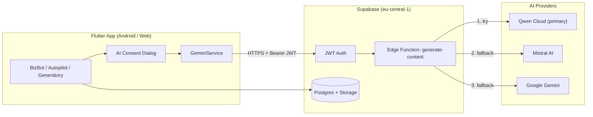

# BizAgent — Hackathon Submission (Qwen Cloud Track)

**Projekt:** BizAgent — AI Business Assistant pre SZČO a malé firmy na Slovensku  
**Web:** https://bizagent.sk  
**Repo:** `youh4ck3dme/produkcia-googlestore-2026`  
**Licencia:** MIT ([LICENSE](../LICENSE))

---

## Elevator pitch (30 s)

BizAgent je mobilná a webová aplikácia, ktorá pomáha slovenským podnikateľom s faktúrami, výdavkami a daňovou agendou. AI vrstva beží cez **bezpečný Supabase Edge Function gateway** s **Qwen Cloud** ako primárnym modelom (Mistral a Gemini ako záložné). Žiadny API kľúč nie je v klientovi — GDPR súhlas pred prvým AI použitím.

---

## Architektúra — Qwen Cloud Gateway



### Kľúčové súbory

| Vrstva | Súbor | Úloha |
|--------|-------|-------|
| Klient | `lib/core/services/gemini_service.dart` | Volá Edge Function, LRU cache, provider priority `qwen → mistral → gemini` |
| Klient | `lib/features/ai_tools/services/biz_bot_service.dart` | BizBot prompty + SK legislatívny kontext |
| Klient | `lib/features/legal/widgets/ai_consent_dialog.dart` | GDPR súhlas pred prvým AI volaním |
| Backend | `supabase/functions/generate-content/index.ts` | Multi-provider chain, retry, model fallback |
| Expenses | `lib/features/expenses/services/expense_autopilot_service.dart` | OCR → AI kategorizácia → auto-commit |

### Prečo Qwen Cloud

1. **OpenAI-compatible API** — jednoduchá integrácia do existujúceho Mistral/Gemini chainu
2. **Nákladová efektivita** — vhodné pre vysokofrekvenčné BizBot a Autopilot volania
3. **Fallback chain** — ak Qwen vráti 429/503, gateway automaticky skúsi Mistral a Gemini
4. **Bezpečnosť** — `QWEN_API_KEY` len v Supabase secrets, nikdy v APK/IPA

### Nasadenie gateway

```bash
supabase secrets set QWEN_API_KEY=sk-... QWEN_MODEL=qwen-plus AI_PRIMARY=qwen
supabase functions deploy generate-content
```

---

## Demo script (5 min)

**Účet:** demo účet z [DEMO_ACCOUNT_SETUP.md](./DEMO_ACCOUNT_SETUP.md) alebo vlastný Google login.

| Čas | Akcia | Čo ukázať |
|-----|-------|-----------|
| 0:00 | Otvor https://bizagent.sk alebo Android app | SK UI, onboarding (3 kroky Play build) |
| 0:30 | **Dashboard** | Prehľad príjmov/výdavkov, daňový teplomer |
| 1:00 | **Faktúra** → vytvor novú | §74 povinné údaje, Pay by Square QR na detaile |
| 1:45 | **ICOatlas** → zadaj IČO `35742364` | Overenie firmy, tlačidlo „Vystaviť faktúru" |
| 2:30 | **AI Tools → BizBot** | Consent dialog → otázka: *„Aký je limit DPH pre SZČO v 2026?"* |
| 3:15 | **Výdavok** → sken bločku (Android) | Autopilot OCR + AI kategorizácia |
| 4:00 | **Bank import** | CSV import SK bánk, párovanie VS |
| 4:30 | **Nastavenia → Privacy** | Qwen/Mistral/Gemini v privacy policy, vymazanie účtu |

### Talking points pre porotu

- **Lokalizácia:** celé UI v slovenčine (`lib/core/i18n/`), SK daňová legislatíva v BizBot kontexte
- **GDPR:** explicitný súhlas, Data Safety guide pre Play Console
- **Produkcia:** živá web app na `bizagent.sk`, Supabase `kpsnwpuydqqojwmrnkdy`

---

## Technický stack

| Oblasť | Technológia |
|--------|-------------|
| Frontend | Flutter 3.13+, Riverpod, GoRouter |
| Backend | Supabase (Auth, Postgres, Edge Functions, Storage) |
| AI Primary | **Qwen Cloud** (DashScope compatible API) |
| AI Fallback | Mistral AI, Google Gemini |
| OCR | Google ML Kit (on-device) |
| Hosting | Firebase Hosting + Vercel (icoatlas proxy) |
| CI | GitHub Actions (Android AAB + Firebase deploy) |

---

## Testovanie pred odovzdaním

```bash
cd /path/to/bizagent
flutter pub get
flutter test test/core/i18n/app_strings_test.dart
flutter test test/core/services/ai_consent_service_test.dart
flutter test test/features/ai_tools/biz_bot_strict_test.dart \
  --dart-define-from-file=dart_defines/supabase.json
```

---

## Kontakt & odkazy

- **Privacy policy:** https://bizagent.sk/privacy-policy.html
- **Play Console Data Safety:** [DATA_SAFETY_PLAY_CONSOLE.md](./DATA_SAFETY_PLAY_CONSOLE.md)
- **Architektúra:** [ARCHITECTURE.md](./ARCHITECTURE.md)